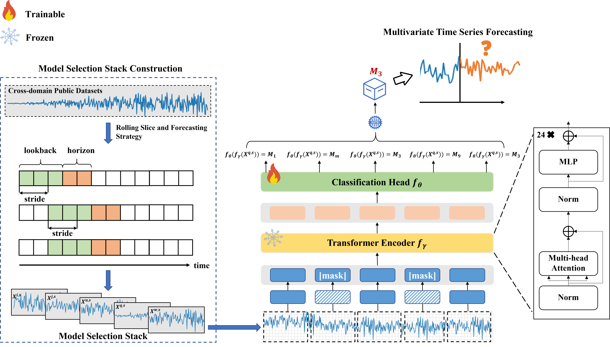

# LOOSE: Optimal Model Selection for Multivariate Time Series Forecasting
 
Our work first compiles a large and heterogeneous labeled model selection dataset (called Model Selection Stack) across 10 domains. Furthermore, we propose a universal Large model-enabled Optimal mOdel SElection method (LOOSE). The framwork of LOOSE is as follow:
<div align="center">

</div>
LOOSE transforms the multivariate time series forecasting (MTSF) model selection problem into a time series classification problem and uses the Model Selection Stack to unlock large-scale multi-dataset training.

## Requirmenets
- Python3.10
- Pytorch==1.13.1
- Numpy==1.23.5
- Sklearn==1.5.2
- Pandas==2.2.3

## Datasets
We used 25 multivariate time series datasets in the  [TFB](https://dl.acm.org/doi/10.14778/3665844.3665863) benchmark.


## Construct Model Selection Stack

Firstly, the rolling forecasting strategy is used to test the forecasting performance of 16 MTSF methods on 25 datasets
We provide the scripts for 16 MTSF methods in the folder `./scripts/multivariate_forecast`. In this foloder, scripts are grouped by horizon. For example, you can reproduce a experiment result with horizon 96 on AQShunyi dataset as the following:

```shell
sh ./scripts/multivariate_forecast/horizon_96/runscripts_AQShunyi.sh
```

The results are stored in the folder `/result`. Next, you can collate the results according to the selected metric (mae/mse/rmse) and stored in `/dataset/metric/horizon_x` as follows:

```shell
python writefile.py -p dataset/metric -r result -ho 96 -m mae
```

To make it easier to view and analyse, we want to store all the results in a table as follows:

```shell
python merge_table.py -s dataset/acc_tables/ -metric dataset/metric -ho 96 -m mae
```

Next, you can create Model Selection Stack based on the setting of horizon, lookback and stride as follows:

```shell
python create_windows_dataset.py -n Forecasting -s dataset/ -p dataset/forecasting/ -m mae -ho 96 -l 336 -win 100
```

## Train and Evaluate LOOSE
You can train our LOOSE using the following command:

```shell
python TrainLOOSE.py -p dataset/Forecasting_432_60/ -b 32 -ep 15 -ho 96 -lo 336
```

The trained LOOSE will be save in the foloder `/results/weights/`. Then, you can evalate the trained LOOSE using the following command:
```shell
python eval_LOOSE.py -d dataset/Forecasting_432_100/ -mp results/weights/ -ps results/raw_predictions -ho 96 -lo 336 
```

Accodingly, the forecasting results will be save in the foloder `/results/raw_predictions/`.

You can merge the forecasting result of LOOSE and MTSF methods using the command:
```shell
python merge_scores.py -p results/raw_predictions/ -m mae -s results/mergescore/ -metric dataset/metric/ -ho 96 -lo 336 -win 100 -n loose
```
The merged table will be save in the folder  `/results/mergescore/`